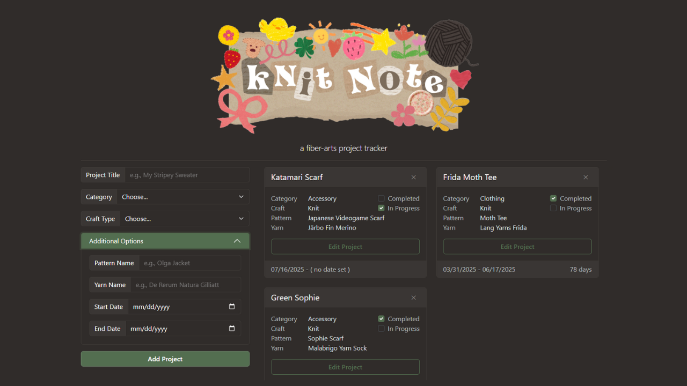
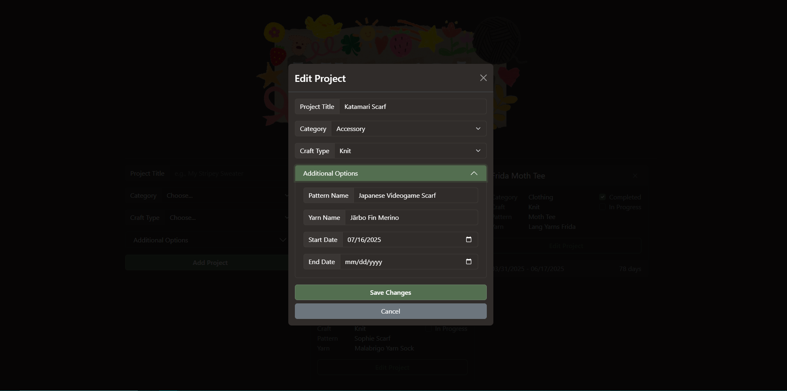
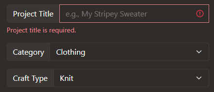
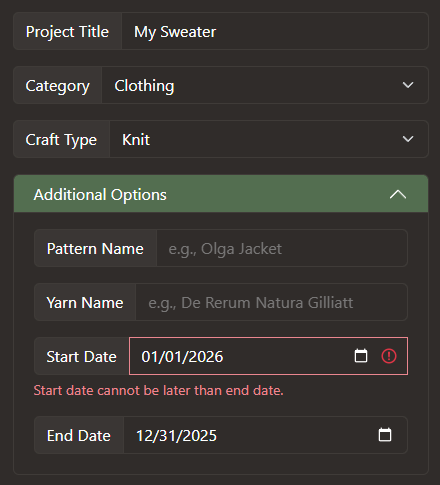

# Knit Note

**A fiber-arts project tracker** — create, edit, and track knitting and crochet projects with full CRUD, client- and server-side validation, and a simple card-based UI.

[](https://imgur.com/a/knit-note-preview-Uu9C6Ud)



---

## Tech stack

| Layer    | Technology        |
|----------|-------------------|
| Frontend | React             |
| Styling  | Bootstrap / React Bootstrap |
| Backend  | Express           |
| Database | SQLite            |

---

## Features

### CRUD

- **Create** — Add a project via the form (title, category, craft, optional pattern, yarn, dates).
- **Read** — Projects are loaded from the database and shown as cards.
- **Update**
  - **Edit form:** Click **Edit Project** on a card → modal opens with current data → save changes to update the card.
  - **Completed:** Check the box, or set an end date when creating/editing.
  - **In progress:** Check the box, or set a start date with no end date when creating/editing.
- **Delete** — Click the **✕** on the right side of a project card header.



### Validation

**Client-side:** Invalid input shows red error messages under the field.

| Input        | Rules |
|-------------|--------|
| Project title (required) | 3–100 characters |
| Category (required)      | Must select one |
| Craft type (required)    | Must select one |
| Pattern (optional)       | If provided: 3–100 characters |
| Yarn (optional)          | If provided: 3–100 characters |
| Start / end date         | Start cannot be after end |

  


**Server-side:**

- **POST** — Same rules as above; `completed` and `progress` set from dates (completed = has end date; in progress = has start, no end).
- **PATCH** — At least one field must be sent; no empty updates.

---

## Project structure

- **`client/`** — React (Vite) frontend.
- **`server/`** — Express API and SQLite (`data.db`).

Run the backend and frontend separately (see below).

---

## Run locally

1. **Backend**
   ```bash
   cd server
   npm install
   npm run dev
   ```
   API runs at `http://localhost:3000`. Ensure `server/.env` has `CLIENT_ORIGIN` if the client is on another port.

2. **Frontend**
   ```bash
   cd client
   npm install
   npm run dev
   ```
   Set `VITE_API_URL=http://localhost:3000` in `client/.env` if needed. Open the URL Vite prints (e.g. `http://localhost:5173`).

---

## References

- [Scrollbar transition (Stack Overflow)](https://stackoverflow.com/a/74050413)
- [Canva (logo, free resources)](https://www.canva.com/)

---

> A **Vercel-ready** version with Next.js, Neon (PostgreSQL), and Google sign-in lives in **`knit-note-vercel/`**. See that folder’s README for deployment and auth.
